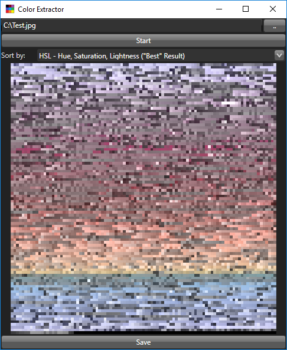
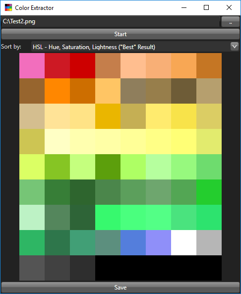

# Color Extractor

Extracts the colors of an image and displays them ordered by perceived brightness. The result can be exported.

Multiple sorts
* HSL
* Hue
* Perceived Brightness
* Hue & Perceived Brightness

Real life examples generally create worse pallets:

Pixel art works quite well:

